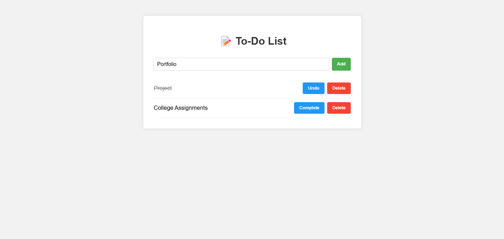

# 📝 To-Do List Application

This is a simple full-stack To-Do List web application built as part of an intern assessment.  
It uses **Node.js (Express)** for the backend and **React.js (Vite)** for the frontend.

---

## 🔧 Tech Stack

- **Frontend:** React.js (Vite)
- **Backend:** Node.js with Express
- **Styling:** HTML, CSS (Responsive without frameworks)
- **Data Store:** In-memory (Array)

---

## 📁 Folder Structure
```project-root/
├── backend/ # Express API (server.js)
├── frontend/ # React frontend (Vite)
├── README.md # ← You are here
```


---

## 🚀 Features

- Add a new task (with title)
- Mark task as completed/uncompleted
- Delete a task
- Responsive design (works on mobile)
- Strike-through for completed tasks
- Clean, structured, and scalable codebase

---

## 🔌 API Endpoints

| Method | Endpoint        | Description                    |
|--------|------------------|--------------------------------|
| GET    | `/tasks`         | Fetch all tasks                |
| POST   | `/tasks`         | Add new task (`title`)         |
| PUT    | `/tasks/:id`     | Toggle task completion         |
| DELETE | `/tasks/:id`     | Delete task                    |

---

## 🖥️ How to Run the Application

### 1. Clone the Repository

```bash
git clone <https://github.com/Rahul-R-Devadiga/To-Do_List_MERN_App>
cd <project-root>
```

### 2. Setup and Run Backend
```bash
cd backend
npm install
npm start
```
> The backend will start at http://localhost:5000

### 3. Setup and Run Frontend
```bash
cd ../frontend
npm install
npm run dev
```
> The frontend will start at http://localhost:5173

## 🌿 Environment Variables
Create a .env file inside frontend/ using the .env.example as reference:
📄 frontend/.env
```env
VITE_API_URL=http://localhost:5000/tasks
```

## 📷 Screenshot
Here’s a preview of the working application:


## 📌 Notes
- No database used (as per instructions)
- Used in-memory array to store tasks
- Code structured with components and pages to reflect production-grade practices

## 👨‍💻 Author
- **Name:** Rahul R Devadiga
- **Role:** Fullstack Developer (NestJS + Next.js + Node.js + MongoDB)